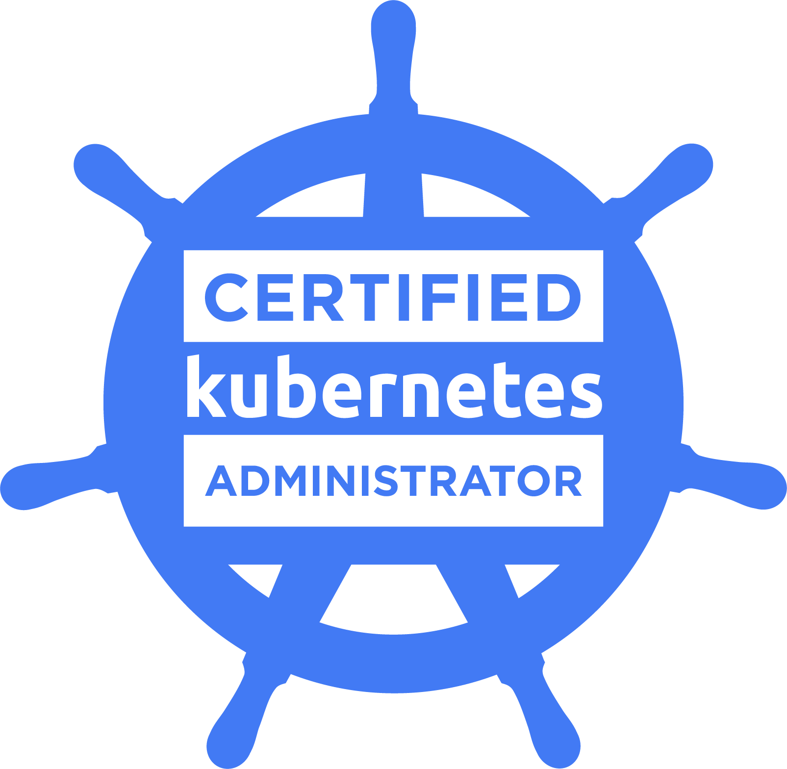

# Intro to Kubernetes

## Notes

- Open source container orchestration tool
- Developed by Google
- Helps manage containerized applications in different deployment environments

## Need for container orchestration tool

- Trend from Monolith to Microservices
- Increased usage of containers
- Demand for a proper way of managing those hundreds of containers

## What features do orchestration tools offer?

- High <b>Availability</b> or no downtime
- <b>Scalability</b> or high performance
- <b>Disaster recovery</b> - backup and restore