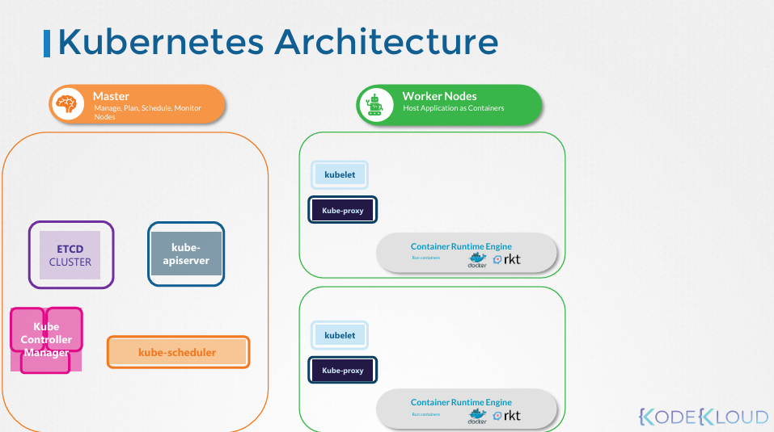

# Cluster Architecture

Udemy Video Link: <https://udemy.com/course/certified-kubernetes-administrator-with-practice-tests/learn/lecture/14280352#overview>

## Diagram

## Notes

A Kubernetes cluster consists of a collection of nodes, which can be categorized into two main types: Worker Nodes and Master Nodes.

### Worker Nodes

These nodes host applications as containers.

- **kubelet**: The agent that listens for instructions from the kube-apiserver and manages applications on the node.
- **kube-proxy**: This service ensures that necessary rules are in place to allow containers on the worker node to communicate with one another.

### Master Node

This node is responsible for managing the cluster. It manages, plans, schedules, and monitors the nodes.

- **ETCD**: A distributed key-value store that holds all the information about the cluster.
- **kube-scheduler**: Identifies the right node for a container to be placed on based on resource availability and other constraints.
- **node-controller**: Manages node operations, including detecting and responding to node failures.
- **replication-controller**: Ensures that the specified number of pod replicas are running at all times.
- **kube-apiserver**: Orchestrates all operations within the cluster, communicating with the schedulers, controllers, and the ETCD cluster.

### Container Runtime Engine

Typically Docker, but Kubernetes can support other container runtimes as well.
