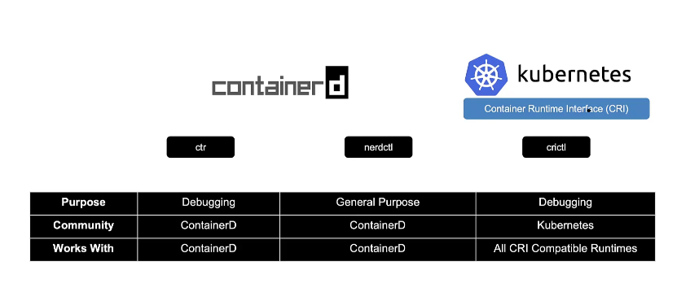

# Docker vs Containerd

Udemy Video Link: <https://udemy.com/course/certified-kubernetes-administrator-with-practice-tests/learn/lecture/37105770#overview>

## Notes

- Kubernetes was initially built to support only Docker.
- Over time, the need to support other container runtimes led to the creation of CRI (Container Runtime Interface) and OCI (Open Container Initiative).
- Support for Docker was deprecated after Kubernetes v1.24, and containerd became the default runtime.
- Docker images are still compatible with containerd.
- For more information, refer to the [Containerd Documentation](https://containerd.io/).

### Tools

- **nerdctl**: Provides a Docker-like CLI for containerd, supporting Docker Compose and the latest features within containerd.
- **crictl**: A CLI for CRI-compatible container runtimes, developed and maintained by the Kubernetes community. It is primarily used for debugging purposes and should not be used to create containers.

### Recommendations

- Containerd is not recommended for running in production environments.
- Use `crictl` only for inspection and debugging runtimes, not for creating containers.
