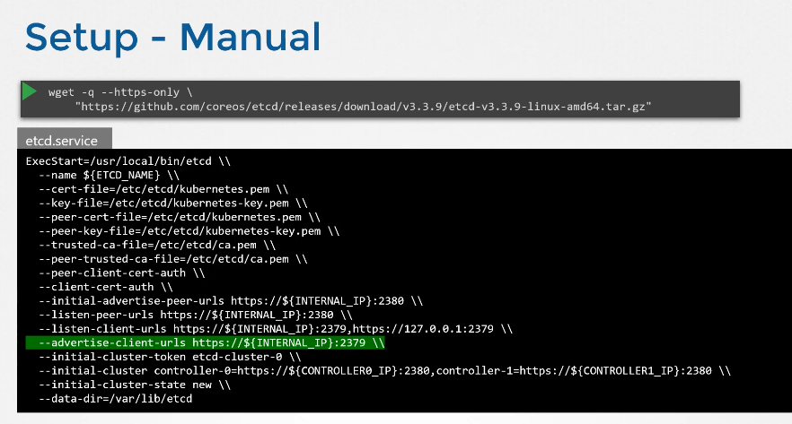
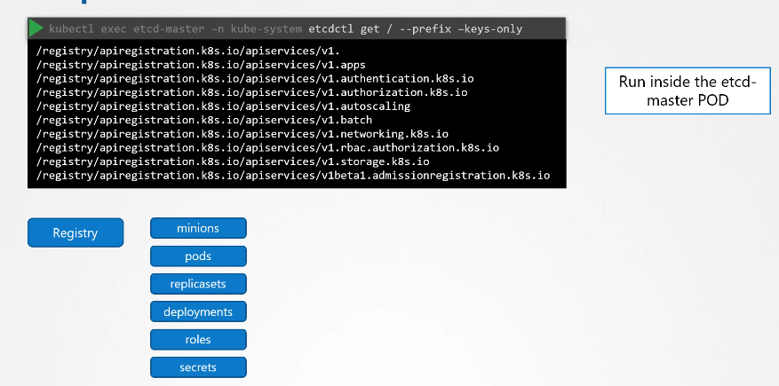

# ETCD in Kubernetes

Udemy Video Link: <https://udemy.com/course/certified-kubernetes-administrator-with-practice-tests/learn/lecture/14298422#overview>

## Notes

- All data retrieved using the `kubectl get` command originates from the ETCD cluster. This includes:

  - Nodes, pods, configurations, secrets, accounts, roles, bindings, and more.

- Any changes made to your cluster are recorded in the ETCD cluster. Until these changes are updated in ETCD, they are not considered complete.

### Manual Cluster Setup

- Download the ETCD binary.
- Configure the `etcd.service` manually.
  

### Automatic Cluster Setup

- Use `kubeadm` for setup.
- Deploy ETCD into the `kube-system` namespace.
- Execute the `etcdctl get` command within the master pod to retrieve a list of keys.
  

**REMEMBER**: The `initial-cluster` option is where you must specify the different instances of the ETCD service.
