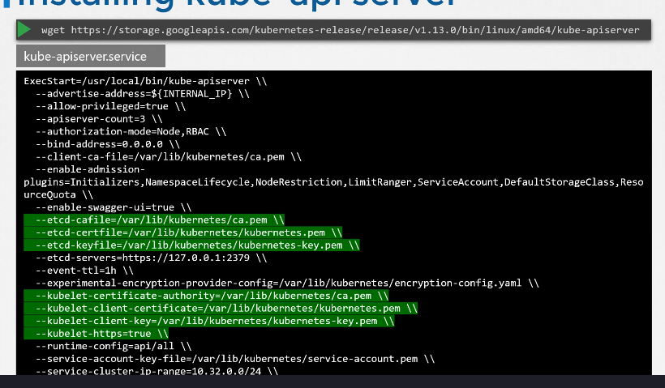

# Kube API Server

Udemy Video Link: <https://udemy.com/course/certified-kubernetes-administrator-with-practice-tests/learn/lecture/14298426#overview>

## Notes

```sh
kubectl get nodes
```

- The `kubectl` utility communicates with the kube-apiserver.
- The kube-apiserver authenticates the command, validates the request, interacts with the ETCD cluster, and returns the data.
- The pods and communicates with kubelet, which then interacts with the kube-apiserver, and updates are made in the ETCD cluster.
- Certificates required for installing the kube-apiserver are shown below:
  
  - This is applicable if you're installing it manually.

```sh
kubectl get pods -n kube-system
```

- Retrieves a list of all the running pods in the kube-system namespace.
