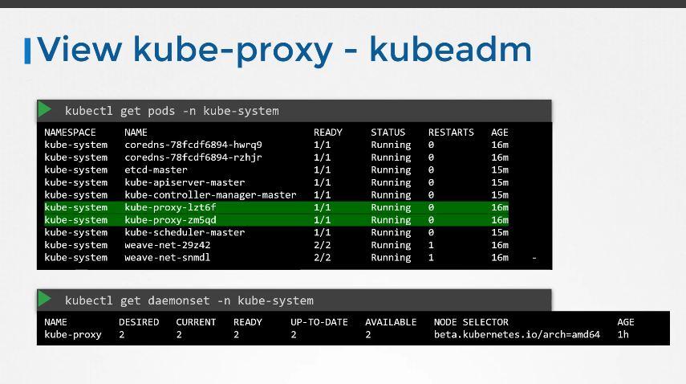

# Kube Proxy

[Udemy Course Link](https://udemy.com/course/certified-kubernetes-administrator-with-practice-tests/learn/lecture/14298434#content)

## Notes

- The primary function of Kube Proxy is to monitor for new services and create the necessary rules to route traffic to the backend pods using iptables.
  - It establishes these rules on each node.
- Kube Proxy can be downloaded from the Kubernetes release page.
- The image below illustrates how Kube Proxy operates and its appearance:
  
